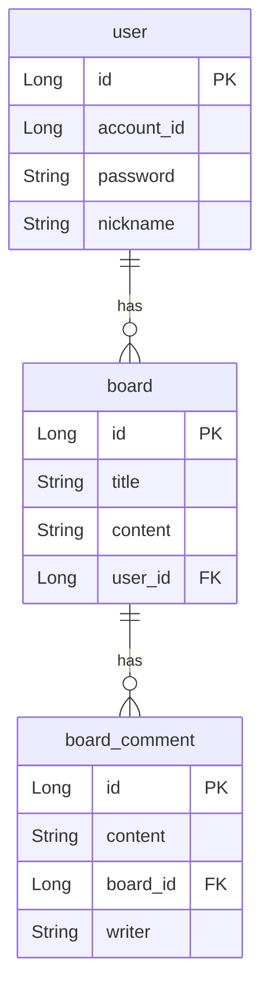

```mermaid
erDiagram
    user {
      Long id PK
      Long account_id
      String password
      String nickname
    }

    board {
        Long id PK
        String title
        String content
        Long user_id FK
    }

    board_comment {
        Long id PK
        String content
        Long board_id FK
        String writer
    }

    board || --o{ board_comment : has
    user || --o{ board : has
```
